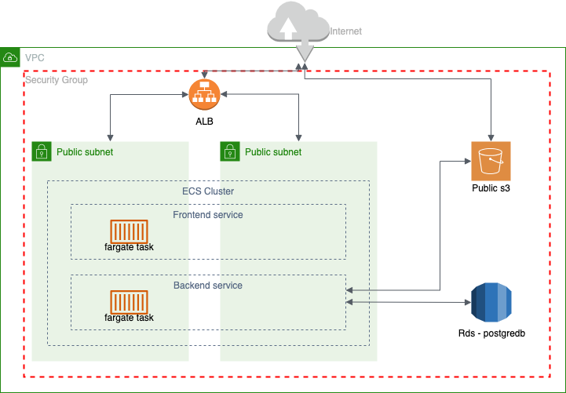

# Project - sthl

[Demo Website](https://dev.sthll.com)

Welcome to sthl! This is a mono repository that contains both the frontend, backend and infrastructure components of this application.

# Table of Contents

1. [Usage](#usage)
1. [Technologies Used](#technologies-used)
1. [Folder structure](#folder-structure)
1. [Features](#features)
1. [Getting start for local development](#getting-start-for-local-development)

   ## Frontend

1. [Packages adopted](#frontend-packages-adopted)
1. [Getting Started](#frontend-getting-started)
1. [Frontend Doing development by env](#frontend-doing-development-by-env)
1. [Frontend Build image by env](#frontend-build-image-by-env)
1. [Frontend Push image to ECR](#frontend-push-image-to-ecr)

   ## Backend

1. [Packages adopted](#backend-packages-adopted)
1. [Getting Started](#backend-getting-started)
1. [Backend Doing development by env](#backend-doing-development-by-env)
1. [Backend Create db model](#backend-create-db-model)
1. [Backend Build image by env](#backend-build-image-by-env)
1. [Backend Push image to ECR](#backend-push-image-to-ecr)

   ## Infrastructure

1. [Getting Started](#infrastructure-terraform)

   ## CICD Deployment

1. [Getting Started](#cicd)

## Usage

Registered user can upload images which not larger than 4mb.

Those images can be used to create products.

Those products will be published on their website so that customers can purchase.

After customers purchase, user can view their orders in cms.

<p align="right"><a href="#top">Back to top</a></p>

## Technologies Used

- Frontend: Next.js

- Backend: Golang

- Database: PostgreSQL

- Infrastructure Provisioning: Terraform + aws

<p align="right"><a href="#top">Back to top</a></p>

## Folder structure

```
.
├── README.md
├── docker-compose.yml                 // to build required infra locally for local development: db and s3
├── backend
│   ├── api                            // Inject services for handlers registration with router
│   ├── authentication                 // jwt, password hashing, etc
│   ├── config                         // port, db config
│   ├── constants                      // fixed value
│   ├── docs                           // swagger
│   ├── logger                         // logger
│   ├── storage                        // db connection client, s3 client, and mock db by docker container
│   ├── ent                            // orm, modeling
│   ├── repository                     // repository pattern deal with db layer
│   ├── dto                            // dto
│   ├── service                        // main logic
│   ├── server                         // http server
│   ├── utils                          // utils
│   ├── go.mod
│   ├── go.sum
│   ├── Dockerfile
│   ├── Makefile
│   └── main.go                        // entry point by running "go run main.go"
├── frontend
│   ├── public                         // images
│   ├── src
│   ├── jest.config.js
│   ├── jest.setup.js
│   ├── next-env.d.ts
│   ├── next-i18next.config.js
│   ├── next.config.js
│   ├── package.json
│   ├── Dockerfile
│   ├── tsconfig.json
│   ├── yarn.lock
│   └── README.md
└── infra                              // terraform aws provision
    ├── dev
    ├── global
    └── modules
```

<p align="right"><a href="#top">Back to top</a></p>

## Features:

- User:

  Signup (password hashed)

  Login (bearer jwt token)

  Logout

  Update password

- Product:

  Create product

  Update product

  Get products

- Order:

  Create order

  Update order

  Get orders

- SiteUI:

  Get site ui data

  Upsert site ui data

- Album:

  Upload img to s3

  Update img to s3

  Delete img to s3

<p align="right"><a href="#top">Back to top</a></p>

## Getting start for local development

simulate local infrastructure by docker-compose first

cd to root directory of this repo

```
docker-compose up -d
```

clean it up

```
docker-compose down
```

<p align="right"><a href="#top">Back to top</a></p>

# Frontend

## Frontend Packages adopted

1. [Nextjs](https://nextjs.org/)
1. [Mantine](https://mantine.dev/pages/getting-started/)
1. [Formik](https://formik.org/)
1. [axios](https://axios-http.com/docs/intro)
1. [cuid](https://github.com/paralleldrive/cuid)
1. [dayjs](https://day.js.org/)
1. [lodash](https://lodash.com/)
1. [query-string](https://github.com/sindresorhus/query-string)
1. [yup](https://github.com/jquense/yup)
1. [fortawesome](https://fontawesome.com/icons)
1. [swiper](https://swiperjs.com/react)
1. [next-i18next](https://github.com/i18next/next-i18next)

<p align="right"><a href="#top">Back to top</a></p>

## Frontend Getting Started

Required: >=Node v18.12.1

Go to frontend directory and install dependency

```
cd frontend
yarn install
```

<p align="right"><a href="#top">Back to top</a></p>

## Frontend Doing development by env

env: local, dev, prod

local envirornment using docker localstack

```
yarn dev:local
```

dev envirornment using aws dev.sthll.com

```
yarn dev:dev
```

prod envirornment using aws sthll.com

```
yarn dev:prod
```

<p align="right"><a href="#top">Back to top</a></p>

## Frontend Build image by env

local

```
docker build -t sthl-frontend-local --no-cache .
```

dev (using aws)

```
docker build -t sthl-frontend-dev --build-arg BUILD_ENV=dev --no-cache .
```

prod (using aws)

```
docker build -t sthl-frontend-prod --build-arg BUILD_ENV=prod --no-cache .
```

<p align="right"><a href="#top">Back to top</a></p>

## Frontend Push image to ECR

only dev and prod

```
aws ecr get-login-password --region {region} | docker login --username AWS --password-stdin {aws_account_id}.dkr.ecr.{region}.amazonaws.com/{repo_name}
```

```
docker tag {image_id} {aws_account_id}.dkr.ecr.{region}.amazonaws.com/{repo_name}:{image_id}
```

```
docker push {aws_account_id}.dkr.ecr.{region}.amazonaws.com/{repo_name}:{image_id}
```

<p align="right"><a href="#top">Back to top</a></p>

# Backend

## Backend Packages adopted

1. [chi](https://github.com/go-chi/chi)
1. [uber-go/zap](https://github.com/uber-go/zap)
1. [uber-go/fx](https://github.com/uber-go/fx)
1. [entgo](https://entgo.io/)
1. [jwt](https://github.com/golang-jwt/jwt)
1. [pq](https://github.com/lib/pq)
1. [aws-sdk-go](https://github.com/aws/aws-sdk-go)
1. [godotenv](https://github.com/joho/godotenv)
1. [ozzo-validation](https://github.com/go-ozzo/ozzo-validation)
1. [testify](https://github.com/stretchr/testify)
1. [gofakeit](https://github.com/brianvoe/gofakeit)
1. [testcontainers-go](https://golang.testcontainers.org/)

<p align="right"><a href="#top">Back to top</a></p>

## Backend Getting Started

Required: >=go v1.20

<p align="right"><a href="#top">Back to top</a></p>

## Backend Doing development by env

example .env for localstack

```
NODE_ENV=develop
PORT=4000
JWT_SECRET=
ALLOW_ORIGIN=http://localhost:3000
VERSION=v1.0

# localstack mode
DB_DOMAIN=127.0.0.1
DB_USER=postgres
DB_PASSWORD=postgres
DB_PORT=5432
S3_PATH=http://localhost:4566
AWS_ACCESS_KEY_ID=test
AWS_SECRET_ACCESS_KEY=test
AWS_REGION=ap-east-1
```

```
cd backend
go run main.go
```

<p align="right"><a href="#top">Back to top</a></p>

## Backend Create db model

```
go run -mod=mod entgo.io/ent/cmd/ent new [T]
make schemabuild
```

<p align="right"><a href="#top">Back to top</a></p>

## Backend Build image by env

```
docker build -t sthl-backend-dev --no-cache .
```

<p align="right"><a href="#top">Back to top</a></p>

## Backend Push image to ECR

only dev and prod

```
aws ecr get-login-password --region {region} | docker login --username AWS --password-stdin {aws_account_id}.dkr.ecr.{region}.amazonaws.com/{repo_name}
```

```
docker tag {image_id} {aws_account_id}.dkr.ecr.{region}.amazonaws.com/{repo_name}:{image_id}
```

```
docker push {aws_account_id}.dkr.ecr.{region}.amazonaws.com/{repo_name}:{image_id}
```

<p align="right"><a href="#top">Back to top</a></p>

# Infrastructure (Terraform)

This project uses Terraform to provision and manage the infrastructure components required for the application. The infrastructure is organized into separate folders for the development and production environments, allowing for clear separation and management of resources.



```
cd infra
```

<p align="right"><a href="#top">Back to top</a></p>

## Folder structure

```
.
├── modules                     // custom tf module
├── global                      // create s3 and dynamodb_table for remote backend of dev,prod
│   ├── main.tf
│   ├── outputs.tf
│   ├── provider.tf
│   ├── terraform.tfstate
│   ├── terraform.tfvars
│   └── variables.tf
├── dev                         // dev environment
│   ├── core                    // network, iam, lb, acm, sg, ecs
│   │   ├── main.tf
│   │   ├── outputs.tf
│   │   ├── provider.tf
│   │   ├── terraform.tfvars
│   │   └── variables.tf
│   ├── service_bn              // application backend: go
│   │   ├── main.tf
│   │   ├── outputs.tf
│   │   ├── provider.tf
│   │   ├── terraform.tfvars
│   │   └── variables.tf
│   └── service_fn              // application frontend: nextjs
│       ├── main.tf
│       ├── provider.tf
│       ├── terraform.tfvars
│       └── variables.tf
└── prod (not yet provision)    // like dev folder
    ...
```

<p align="right"><a href="#top">Back to top</a></p>

# CICD

This project implements CI/CD using GitHub Actions to automate the build, testing, and deployment processes.

The CI/CD pipeline consists of multiple workflows, each serving a specific purpose.

All workflows are triggered manully due to this is just side project.

1. bn-image-build.yml Workflow:

   - Includes running unit tests, building docker image, pushing image to ECR.

   - dev branch -> dev ECR ; main branch -> prod ECR

2. bn-deploy.yml Workflow:

   - Includes running unit tests, building docker image, pushing image to ECR, deploy to corresponding environment.

   - dev branch -> dev ; main branch -> prod

3. fn-image-build.yml Workflow:

   - Includes running unit tests, building docker image, pushing image to ECR.

   - dev branch -> dev ECR ; main branch -> prod ECR

4. fn-deploy.yml Workflow:

   - Includes running unit tests, building docker image, pushing image to ECR, deploy to corresponding environment.

   - dev branch -> dev ; main branch -> prod

<p align="right"><a href="#top">Back to top</a></p>
